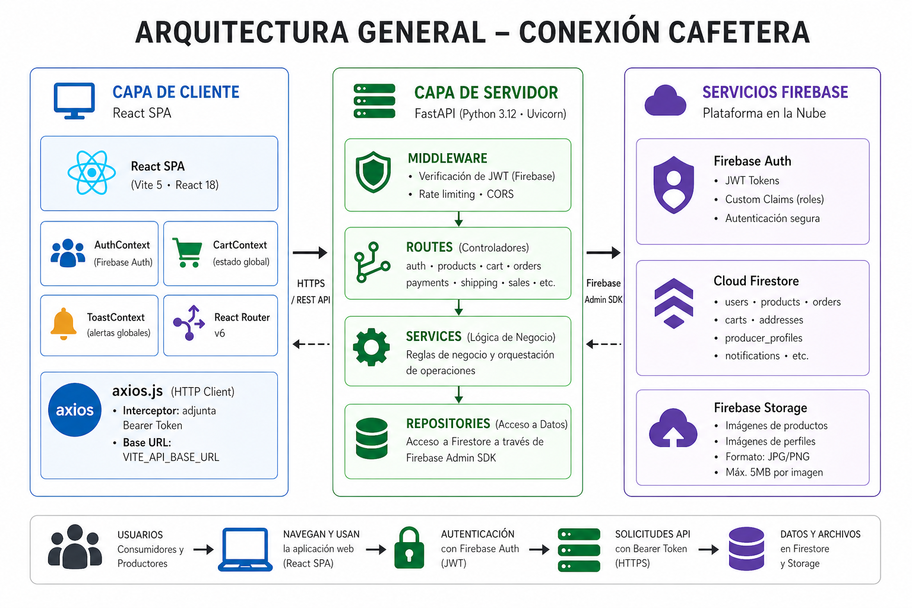
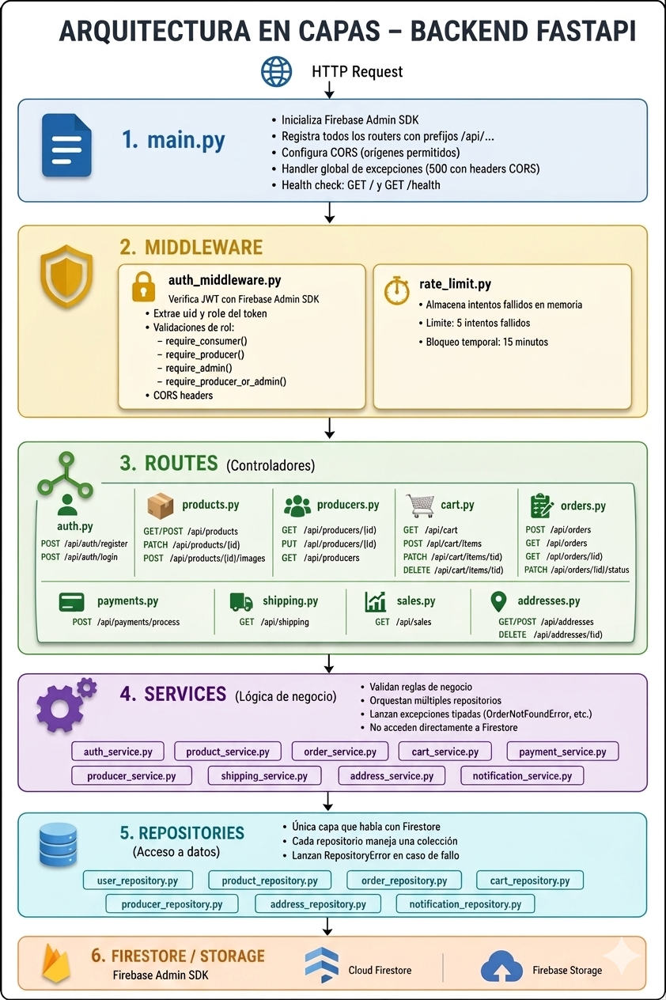
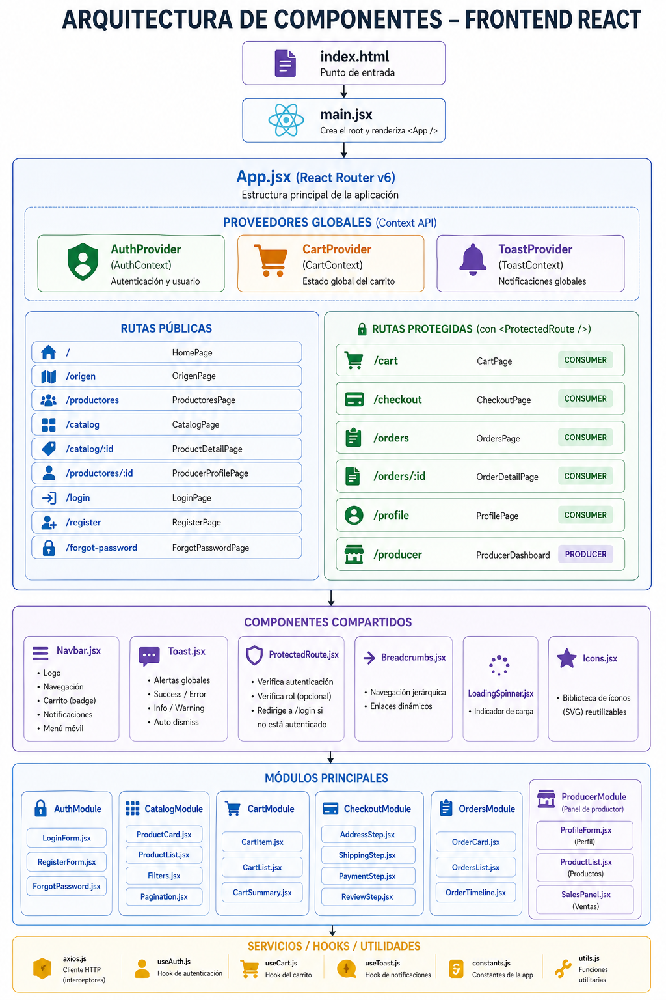
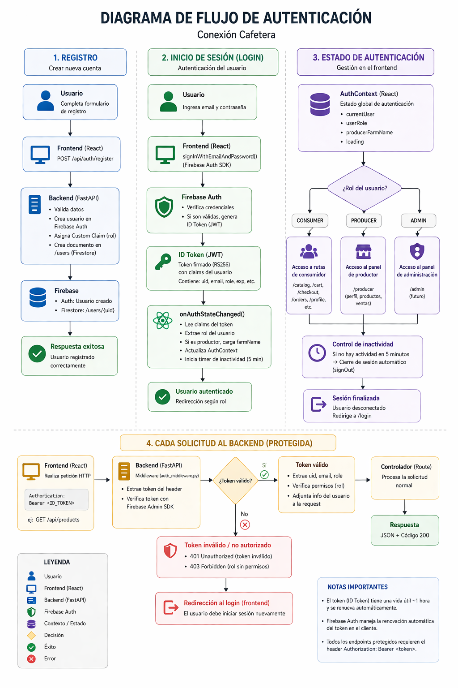
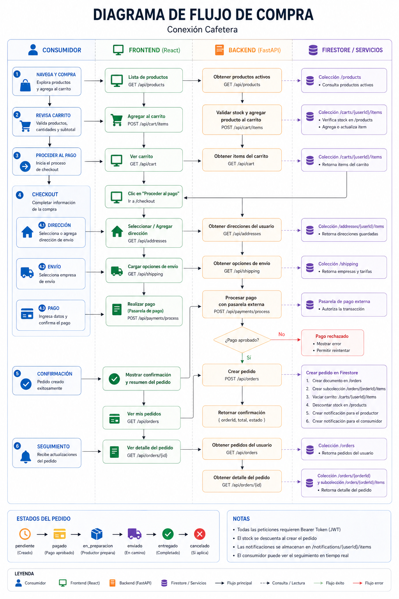
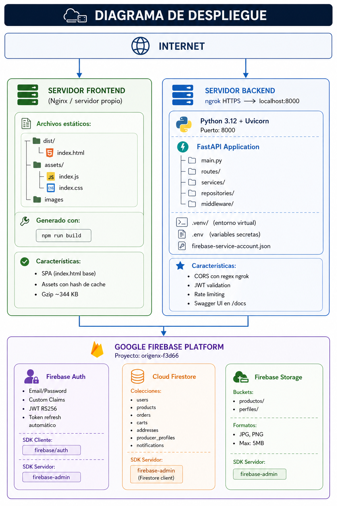

# 🏗️ Diagramas de Arquitectura – Conexión Cafetera

**MFRAL TECH** · Universidad Autónoma de Occidente · 2026

---

## Tabla de contenido

1. [Arquitectura general del sistema](#1-arquitectura-general-del-sistema)
2. [Diagrama de capas del backend](#2-diagrama-de-capas-del-backend)
3. [Diagrama de componentes del frontend](#3-diagrama-de-componentes-del-frontend)
4. [Diagrama de flujo de autenticación](#4-diagrama-de-flujo-de-autenticación)
5. [Diagrama de flujo de compra](#5-diagrama-de-flujo-de-compra)
6. [Modelo de datos Firestore](#6-modelo-de-datos-firestore)
7. [Diagrama de secuencia – Crear pedido](#7-diagrama-de-secuencia--crear-pedido)
8. [Diagrama de despliegue](#8-diagrama-de-despliegue)

---

## 1. Arquitectura general del sistema



---

## 2. Diagrama de capas del backend




---

## 3. Diagrama de componentes del frontend




---

## 4. Diagrama de flujo de autenticación



---

## 5. Diagrama de flujo de compra



---


## 6. Modelo de datos Firestore

```
╔══════════════════════════════════════════════════════════════════════╗
║                    MODELO DE DATOS – CLOUD FIRESTORE                 ║
╚══════════════════════════════════════════════════════════════════════╝

  /users/{userId}
  ┌─────────────────────────────────────────────────────────────────┐
  │  id          : string   (Firebase UID)                          │
  │  name        : string                                           │
  │  email       : string                                           │
  │  role        : "CONSUMER" | "PRODUCER" | "ADMIN"               │
  │  createdAt   : timestamp                                        │
  │  updatedAt   : timestamp                                        │
  └─────────────────────────────────────────────────────────────────┘

  /products/{productId}
  ┌─────────────────────────────────────────────────────────────────┐
  │  id            : string   (auto-generado)                       │
  │  producerId    : string   (Firebase UID del productor)          │
  │  producerName  : string   (snapshot del nombre de finca)        │
  │  producerRegion: string                                         │
  │  name          : string                                         │
  │  description   : string   (HTML enriquecido)                    │
  │  price         : number   (COP)                                 │
  │  stock         : number   (unidades disponibles)                │
  │  status        : "active" | "inactive"                          │
  │  createdAt     : timestamp                                      │
  │  updatedAt     : timestamp                                      │
  │                                                                 │
  │  Subcolección: /products/{productId}/images/{imageId}           │
  │  ┌───────────────────────────────────────────────────────────┐  │
  │  │  id          : string                                     │  │
  │  │  url         : string   (URL pública Firebase Storage)    │  │
  │  │  storagePath : string   (ruta interna en Storage)         │  │
  │  │  sortOrder   : number   (orden de visualización)          │  │
  │  │  createdAt   : timestamp                                  │  │
  │  └───────────────────────────────────────────────────────────┘  │
  └─────────────────────────────────────────────────────────────────┘

  /orders/{orderId}
  ┌─────────────────────────────────────────────────────────────────┐
  │  id              : string                                       │
  │  consumerId      : string   (Firebase UID)                      │
  │  status          : "pendiente"|"pagado"|"en_preparacion"|       │
  │                    "enviado"|"entregado"|"cancelado"            │
  │  total           : number   (COP)                               │
  │  shippingCompany : string                                       │
  │  shippingCost    : number                                       │
  │  transactionId   : string | null                                │
  │  addressSnapshot : {                                            │
  │      street, city, department, postalCode                       │
  │  }                                                              │
  │  createdAt       : timestamp                                    │
  │  updatedAt       : timestamp                                    │
  │                                                                 │
  │  Subcolección: /orders/{orderId}/items/{itemId}                 │
  │  ┌───────────────────────────────────────────────────────────┐  │
  │  │  id                  : string                             │  │
  │  │  productId           : string                             │  │
  │  │  productNameSnapshot : string   (nombre al momento)       │  │
  │  │  priceSnapshot       : number   (precio al momento)       │  │
  │  │  quantity            : number                             │  │
  │  └───────────────────────────────────────────────────────────┘  │
  └─────────────────────────────────────────────────────────────────┘

  /carts/{userId}/items/{itemId}
  ┌─────────────────────────────────────────────────────────────────┐
  │  productId   : string                                           │
  │  productName : string                                           │
  │  price       : number                                           │
  │  quantity    : number                                           │
  │  imageUrl    : string | null                                    │
  │  addedAt     : timestamp                                        │
  └─────────────────────────────────────────────────────────────────┘

  /producer_profiles/{producerId}
  ┌─────────────────────────────────────────────────────────────────┐
  │  farmName          : string                                     │
  │  region            : string                                     │
  │  description       : string   (HTML enriquecido)                │
  │  email             : string                                     │
  │  altEmail          : string | null                              │
  │  whatsapp          : string | null                              │
  │  showRegisterEmail : boolean                                    │
  │  showAltEmail      : boolean                                    │
  │  images            : string[]  (URLs de Firebase Storage)       │
  │  updatedAt         : timestamp                                  │
  └─────────────────────────────────────────────────────────────────┘

  /addresses/{userId}/items/{addressId}
  ┌─────────────────────────────────────────────────────────────────┐
  │  street     : string                                            │
  │  city       : string                                            │
  │  department : string                                            │
  │  postalCode : string                                            │
  │  isDefault  : boolean                                           │
  │  createdAt  : timestamp                                         │
  └─────────────────────────────────────────────────────────────────┘

  /notifications/{userId}/items/{notificationId}
  ┌─────────────────────────────────────────────────────────────────┐
  │  orderId   : string                                             │
  │  message   : string                                             │
  │  read      : boolean                                            │
  │  createdAt : timestamp                                          │
  └─────────────────────────────────────────────────────────────────┘

```
---

## 7. Diagrama de despliegue



---

## Resumen de endpoints por módulo

```
╔══════════════════════════════════════════════════════════════════════╗
║                    MAPA DE ENDPOINTS – REST API                      ║
╚══════════════════════════════════════════════════════════════════════╝

  BASE URL: http://187.77.22.186:8000

  ┌─────────────────────────────────────────────────────────────────┐
  │  AUTENTICACIÓN          /api/auth                               │
  │  POST   /register       Registrar nuevo usuario                 │
  │  POST   /login          Iniciar sesión (Firebase)               │
  └─────────────────────────────────────────────────────────────────┘

  ┌─────────────────────────────────────────────────────────────────┐
  │  PRODUCTOS              /api/products                           │
  │  GET    /               Listar productos activos (catálogo)     │
  │  POST   /               Crear producto              [PRODUCER]  │
  │  GET    /{id}           Detalle de producto                     │
  │  PATCH  /{id}           Actualizar producto          [PRODUCER] │
  │  PATCH  /{id}/status    Activar/desactivar           [PRODUCER] │
  │  GET    /{id}/images    Listar imágenes                         │
  │  POST   /{id}/images    Subir imagen                 [PRODUCER] │
  │  DELETE /{id}/images/{imgId}  Eliminar imagen        [PRODUCER] │
  └─────────────────────────────────────────────────────────────────┘

  ┌─────────────────────────────────────────────────────────────────┐
  │  PRODUCTORES            /api/producers                          │
  │  GET    /{id}           Perfil público del productor            │
  │  PUT    /{id}           Actualizar perfil            [PRODUCER] │
  │  GET    /               Listar todos los productores            │
  └─────────────────────────────────────────────────────────────────┘

  ┌─────────────────────────────────────────────────────────────────┐
  │  CARRITO                /api/cart                               │
  │  GET    /items          Ver ítems del carrito        [CONSUMER] │
  │  POST   /items          Agregar ítem                 [CONSUMER] │
  │  PATCH  /items/{id}     Actualizar cantidad          [CONSUMER] │
  │  DELETE /items/{id}     Eliminar ítem                [CONSUMER] │
  │  DELETE /items          Vaciar carrito               [CONSUMER] │
  └─────────────────────────────────────────────────────────────────┘

  ┌─────────────────────────────────────────────────────────────────┐
  │  PEDIDOS                /api/orders                             │
  │  POST   /               Crear pedido                 [CONSUMER] │
  │  GET    /               Historial de pedidos         [CONSUMER] │
  │  GET    /{id}           Detalle de pedido            [CONSUMER] │
  │  PATCH  /{id}/status    Actualizar estado     [PRODUCER|ADMIN]  │
  └─────────────────────────────────────────────────────────────────┘

  ┌─────────────────────────────────────────────────────────────────┐
  │  VENTAS                 /api/sales                              │
  │  GET    /               Panel de ventas del productor [PRODUCER]│
  │         ?from_date=YYYY-MM-DD&to_date=YYYY-MM-DD                │
  └─────────────────────────────────────────────────────────────────┘

  ┌─────────────────────────────────────────────────────────────────┐
  │  PAGOS                  /api/payments                           │
  │  POST   /process        Procesar pago                [CONSUMER] │
  └─────────────────────────────────────────────────────────────────┘

  ┌─────────────────────────────────────────────────────────────────┐
  │  ENVÍOS                 /api/shipping                           │
  │  GET    /               Listar opciones de envío                │
  └─────────────────────────────────────────────────────────────────┘

  ┌─────────────────────────────────────────────────────────────────┐
  │  DIRECCIONES            /api/addresses                          │
  │  GET    /               Listar direcciones           [CONSUMER] │
  │  POST   /               Crear dirección              [CONSUMER] │
  │  PUT    /{id}           Actualizar dirección         [CONSUMER] │
  │  DELETE /{id}           Eliminar dirección           [CONSUMER] │
  └─────────────────────────────────────────────────────────────────┘

  ┌─────────────────────────────────────────────────────────────────┐
  │  HEALTH CHECK                                                   │
  │  GET    /               Estado del servidor                     │
  │  GET    /health         Estado detallado                        │
  │  GET    /docs           Swagger UI (documentación interactiva)  │
  │  GET    /redoc          ReDoc (documentación alternativa)       │
  └─────────────────────────────────────────────────────────────────┘
```

